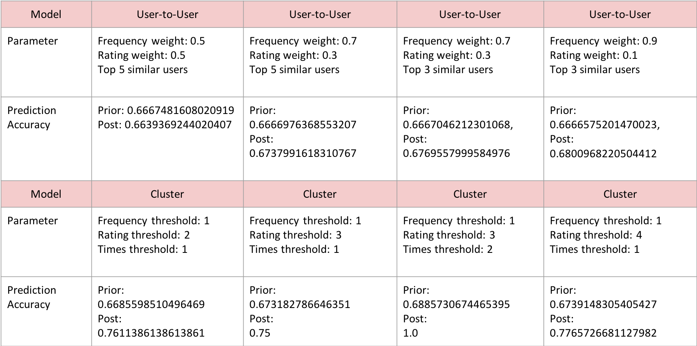

# CMSC12300_Project Yelp Recommendation

Group members:  
Ying Sun  
Jiaxu Han  
Fulin Guo  
Ellen Hsieh

## How to run:

### In terminal:

#### Clustering Algorithm:
python3 cluster_model_1.py -r dataproc --num-core-instances 6 cluster_data.csv

python3 cluster_model_2.py -r dataproc --num-core-instances 6 cluster_data.csv

python3 cluster_model_3.py -r dataproc --num-core-instances 6 cluster_data.csv

python3 cluster_model_4.py -r dataproc --num-core-instances 6 cluster_data.csv

#### User-to-user Algorithm:

python3 user_to_user_model_1.py -r dataproc --num-core-instances 6 user_to_user_data.csv

python3 user_to_user_model_2.py -r dataproc --num-core-instances 6 user_to_user_data.csv

python3 user_to_user_model_3.py -r dataproc --num-core-instances 6 user_to_user_data.csv

python3 user_to_user_model_4.py -r dataproc --num-core-instances 6 user_to_user_data.csv

#### *Note.*

cluster_data.csv can be found in Data folder

user_to_user_data.csv can be downloaded from a public bucket gs://hanjiaxu/user_to_user.csv (see Data folder readme)

Other .py files can be found in Code folder

#### *Parameters*

#### cluster_model_1: 

Frequency threshold: 1
Rating threshold: 2
Times threshold: 1

#### cluster_model_2:

Frequency threshold: 1
Rating threshold: 3
Times threshold: 1

#### cluster_model_3:

Frequency threshold: 1;
Rating threshold: 3; 
Times threshold: 2

#### cluster_model_4:

Frequency threshold: 1;
Rating threshold: 4;
Times threshold: 1

#### user_to_user_model_1:

Weight: 0.5;
Top 5 similar users

#### user_to_user_model_2:

Weight: 0.7；
Top 5 similar users

#### user_to_user_model_3:

Weight: 0.5；
Top 3 similar users

#### user_to_user_model_4:

Weight: 0.7；
Top 3 similar users

#### *Result*

##### Please refer to the final report for specific meanings about the parameters

